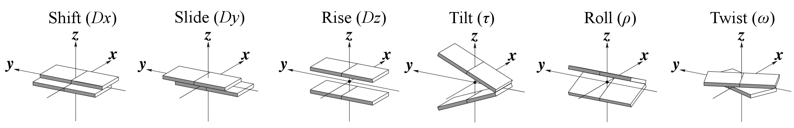
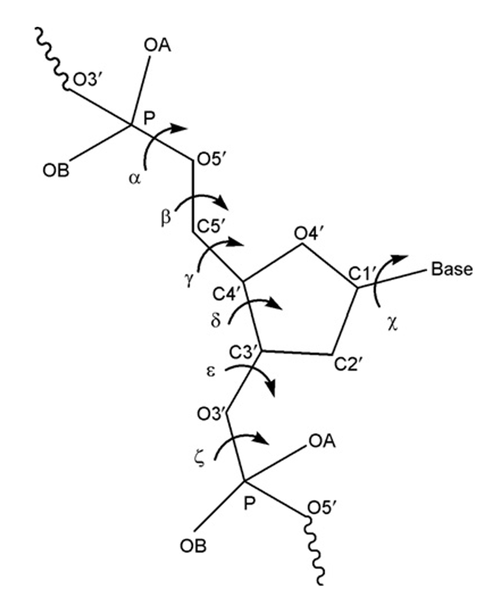
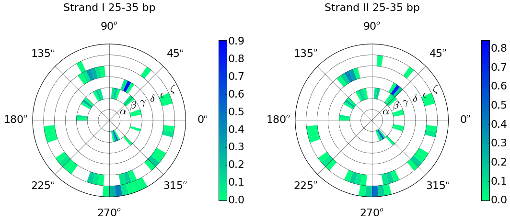
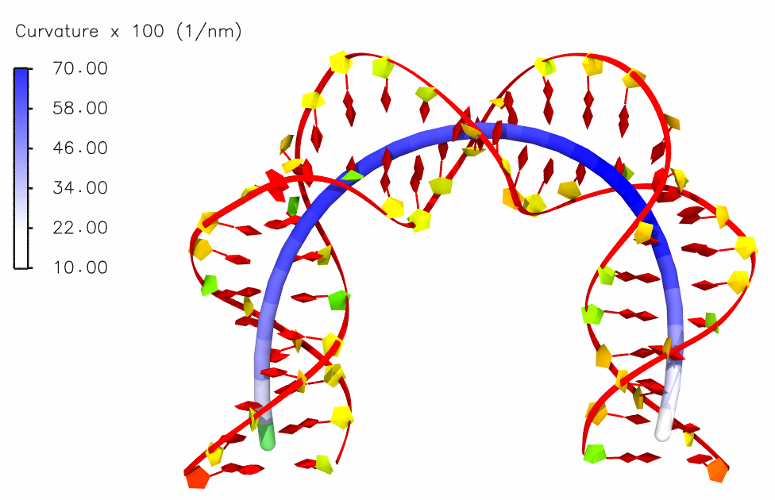

.. do_x3dna documentation master file, created by
   sphinx-quickstart on Thu Aug 21 15:46:15 2014.
   You can adapt this file completely to your liking, but it should at least
   contain the root `toctree` directive.

.. |3DNA package| raw:: html

   <a href="http://x3dna.org" target="_blank">3DNA package</a>

.. |mitochondiral DNA| raw:: html

   <a href="http://pdb.org/pdb/explore/explore.do?structureId=3tmm" target="_blank">mitochondiral DNA</a>

.. |nucleosome| raw:: html

   <a href="http://pdb.org/pdb/explore/explore.do?structureId=3Ut9" target="_blank">nucleosome</a>

Introduction
============

do_x3dna has been developed for analysis of the DNA/RNA dynamics during the molecular dynamics simulations.
It consists of three main components:

    * `do_x3dna`_ - To calculate structural descriptors of DNA/RNA from MD trajectory.
    * `dnaMD`_    - To extract and analyze the data obtained from do_x3dna.
    * `dnaMD Python module`_ - To extract and analyze the data obtained from do_x3dna.

do_x3dna
--------
It is the wrapper tool, which uses |3DNA package| to calculate several structural
descriptors of DNA/RNA from the GROMACS MD trajectory. It executes 3DNA tools to
calculate these descriptors and subsequently, extracts these output and saves in to
external `output files <http://do-x3dna.readthedocs.io/en/latest/do_x3dna_usage.html#output-files>`_
as a function of time.

**GROMACS versions supported:** 4.5.x, 4.6.x, 5.0.x, 5.1.x, and 2016.x versions.
For higher versions, a PDB file can be used in place of a GROMACS **tpr** file.

.. note::
    do_x3dna can be used with trajectory files that are obtained from other MD packages such as NAMD and AMBER.
    Input trajectory files should be converted in to Gromacs format trajectory files. A PDB file could be used in place
    of a GROMACS **tpr** file.

dnaMD
-----
`do_x3dna`_ generates large amount of data and analyzing these data is difficult.
Therefore, ``dnaMD`` is developed to analyze data obtained from `do_x3dna`_. It contains
set of tools to analyze the data.

dnaMD Python module
-------------------
`dnaMD`_ is written in Python and it is also available as Python module.
It can be used in Python scripting for fast and flexible analysis of `do_x3dna`_
data.

**Last Update: June. 2017**

Features
--------

Base-pair parameters
~~~~~~~~~~~~~~~~~~~~

.. image:: ./images/bp_parameters.png
   :scale: 28 %
   :align: center

Base-step parameters
~~~~~~~~~~~~~~~~~~~~

Helical Base-stesp parameters
~~~~~~~~~~~~~~~~~~~~~~~~~~~~~

.. image:: ./images/bph_parameters.png
   :scale: 28 %
   :align: center

Major and minor grooves
~~~~~~~~~~~~~~~~~~~~~~~

Radius of DNA Helix
~~~~~~~~~~~~~~~~~~~

Backbone torsional angles
~~~~~~~~~~~~~~~~~~~~~~~~~

**Example**: Conformational wheel using backbone torsion angles:

Helical axis and its curvature
~~~~~~~~~~~~~~~~~~~~~~~~~~~~~~

**Examples:**

* Bending in the helical axis of a |mitochondiral DNA|:

-------

* Bending in the helical axis of a DNA in the |nucleosome|:

.. image:: ./images/p3ut9.png
   :scale: 70 %
   :align: center

--------

Citations
---------

**Please cite the follwoing publications:**

* | Xiang-Jun Lu & Wilma K. Olson (2003)
  | 3DNA: a software package for the analysis, rebuilding and visualization of three-dimensional nucleic acid structures.
  | *Nucleic Acids Res.* 31(17), 5108-21.

* | Rajendra Kumar and Helmut Grubmüller (2015)
  | `do_x3dna: a tool to analyze structural fluctuations of dsDNA or dsRNA from molecular dynamics simulations <https://doi.org/10.1093/bioinformatics/btv190>`_
  | *Bioinformatics* (2015) 31 (15): 2583-2585.

Contents
--------

.. toctree::
   :maxdepth: 1

   Download and Install do_x3dna <install_do_x3dna>
   Install dnaMD <install_dnaMD>
   How to use do_x3dna? <do_x3dna_usage>
   How to use dnaMD? <dnaMD_usage>
   dnaMD Python module <api_summary>
   dnaMD Python module Tutorial <tutorial>
   View on GitHub <https://github.com/rjdkmr/do_x3dna>

Indices and tables
==================

* :ref:`genindex`
* :ref:`modindex`
* :ref:`search`
